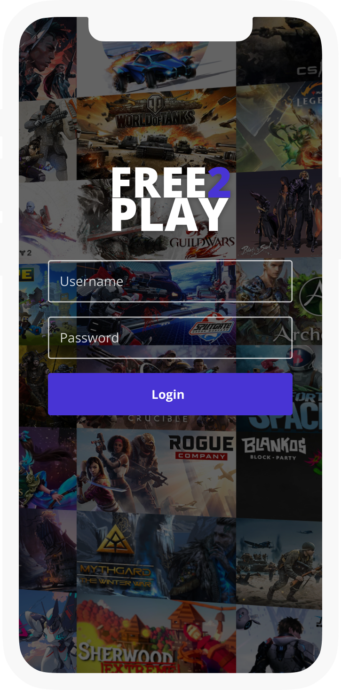
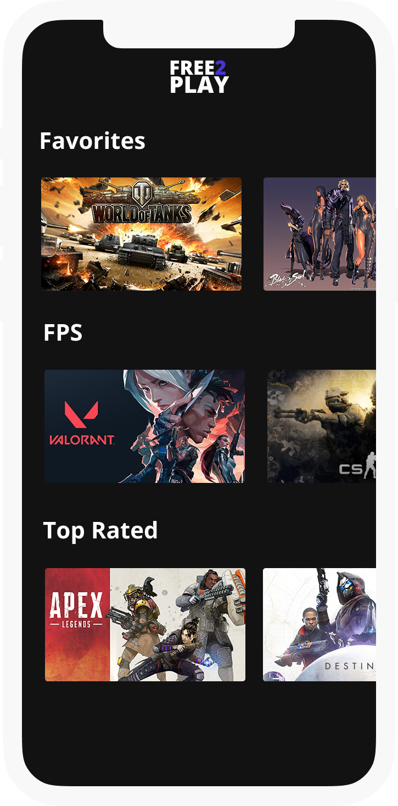
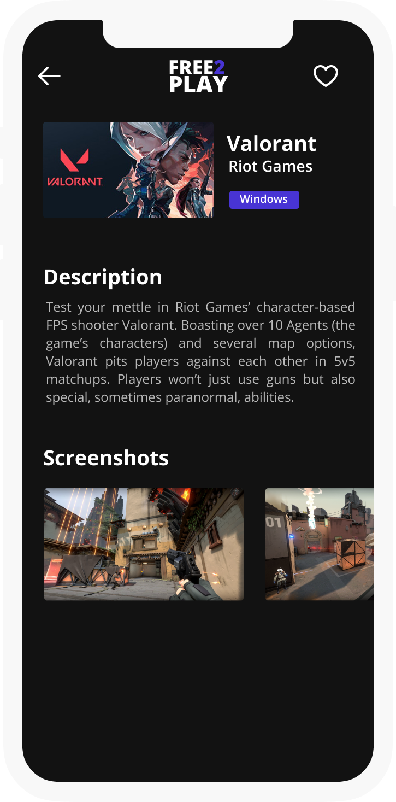

<!-- # Free 2 Play -->

<image align="center" src="readme_assets/logo.png" width=100 alt="free2play" ></image>
#### Atividade final da disciplina de Programação de Dispositivos Móveis (PDM).

[Link Notion](https://github.com/MikaelSantilio/free2play)  
[Link Figma](https://www.figma.com/file/vs4GZomZM1q91uaPNm42Jm/Free-2-Play?node-id=4%3A2)

## Descrição da atividade

Crie um aplicativo que consuma uma API no formato mestre-detalhe e que seja disponível offline através de um repositório local.

## Atividades propostas

1) Consuma uma API com uma entidade principal e outras entidades filhas.
2) Exiba as entidades em uma lis#tagem das entidades principais e das entidades de detalhe.
3) Proponha um mecanismo em que, caso o celular esteja sem conexão, sejam exibidos os dados locais.
4) Proponha também um mecanismo de adição e exclusão, mantendo a sincronicidade entre: listagem, banco local e WEB API.

## Aplicativo

#### Telas

<table style="width:100%">
  <tr>
    <th>Login</th>
    <th>Listagem</th>
    <th>Detalhes</th>
  </tr>
  <tr>
    <td> <image src="readme_assets/Login.png" ></image> </td>
    <td> <image src="readme_assets/listagem.png" ></image> </td>
    <td> <image src="readme_assets/Detalhes.png" ></image> </td>
  </tr>
</table>

<!-- 

Tela de login

Tela principal

Tela de detalhes -->

## Projeto

#### Descrição da API

<image src="readme_assets/api_games.png" width=500 ></image>

#### Listagem Online/Offline

<image src="readme_assets/online.png" width=700 ></image>

#### Persistência Offline

<image src="readme_assets/offline.png" width=700 ></image>

